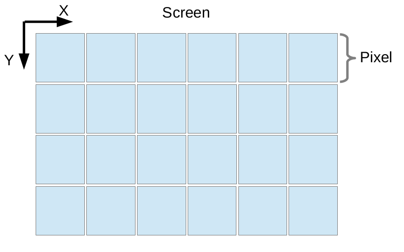
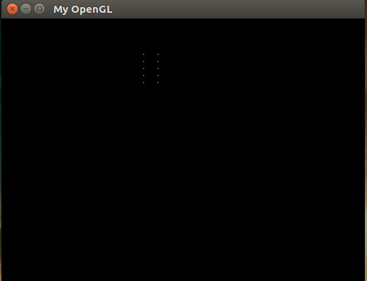
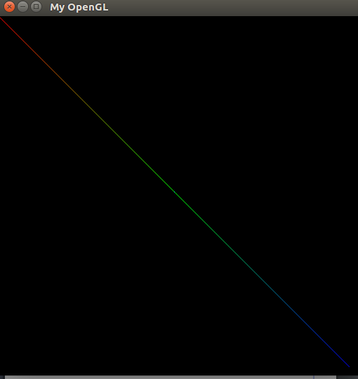
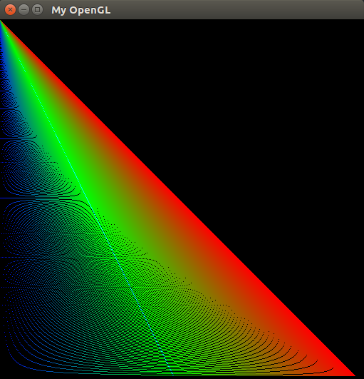
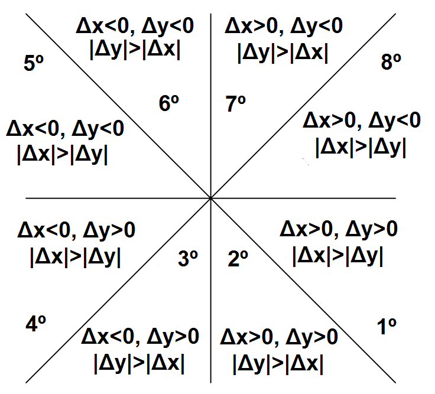
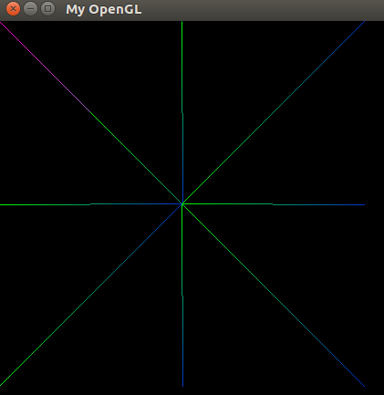
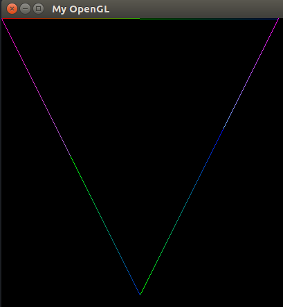

# CG-First-Task
---
Rasterization Algorithms

## Menu

* [Introduction](#introduction)
* [Points Rasterization](#points-rasterization)
* [Digital Differential Analyzer](#digital-differential-analyzer)
* [Bresenham Algorithm](#bresenham-algorithm)
* [Drawing Triangles](#drawing-triangles)
* [Conclusion](#conclusion)
* [References](#references)
* [Build Instructions](#build-instructions)

---

### Introduction
Actually  what does this article say about? Well, it will describle what Rasterization Alogirthms are and how they are implemented. We will see two known algorithms , the Bresenham Algorithm and Digital Differential Analyzer Algorithm. The article has as objective the implementation of rasterization algorithms to perform the rendering of points and lines.The motivation for this task is to complement the note for the Computer Graphics discipline taught by the teacher Christian Pagot in Federal University of Paraiba.

---

### Points Rasterization
"Approximation of mathematical primitives, crescribed in terms of vertices on a Cartesian grid, by sets of pixels of the appropriate intensity of gray or color.”— Foley et. al

That is, Rasterization is the technique of taking an image described in a vector graphics format and transform it into a set of pixels for output on a screen. Through this technique you can be able to draw vector images. To realize this operation have must to activate the display pixels with specific colors to draw the image requested. The image below will to explain better how work the screen rasterization.

<p align="center">
	<br>
	
	<h5 align="center">Figure 1 - Rasterization representation</h5>
	<br>
</p>

Now let's look more close the function destined to execute the point rasterization.
```C++
void putPixel(int xWidth, int yHeight, std::vector<int>& myRGBA) {
	for (size_t i = 0; i < 4; i++) {
	FBptr[xWidth*4+i + yHeight*4*IMAGE_WIDTH] = myRGBA.at(i);
	}
}
```
The function above describes:
1. xWidth is the position of the pixel related the screen width.
2. yHeight is the position of the pixel related the screen height.
3. myRGBA is the color vector related the pixel.

The RGBA standard  to require four bytes. Each byte it is destined for the primaries color RGBA that mean RED, GREEN, BLUE and ALPHA. With this function we can draw a point on the screen like the below picture show it.

<p align="center">
	<br>
	
	<h5 align="center">Figure 2 - Pixel drawn on screen</h5>
	<br>
</p>

---

### Lines Rasterization
The task of drawing a pixel on the screen was a bit easy, right? Now, we have a challenge that is to draw a line and this task is not as easy as you think, but to help us, there are some algorithms that can do this for us, however it is very important to understand them.

#### Digital Differential Analyzer (DDA)
Digital Differential Analyzer (DDA) algorithm is the simple line generation algorithm.

Now let's look more close the DDA Algorithm.
```C++
void ddaAlgorithm(int x1, int y1, int x2, int y2, std::vector<int>& myRGBA) {
  float dx = x2-x1;
  float dy = y2-y1;

  float m = dy/dx;
  float b = y1 - (m*x1);

  int j = 0;
  for (size_t i = 0; i < dx; i++) {
    colorInterpolation(i, &j, dx, &myRGBA);
    putPixel(x1+i, round(m*(x1+i)+b), myRGBA);
  }
}
```
The algorithm above describe:
1. dx is the variation/range between x2 and x1 points.
2. dy is the variation/range between y2 and y1 points.
3. m is the coefficient of the line. 
4. b is the linear coefficient of the line.

The image describes a line drawn on the screen using the DDA Algorithm. 
<p align="center">
	<br>
	
	<h5 align="center">Figure 3 - Line drawn with DDA</h5>
	<br>
</p>

The DDA Algorithm only draws in the first quadrant as you can see in the image below and is a problem if you want to draw on other areas of the screen. 

<p align="center">
	<br>
	
	<h5 align="center">Figure 4 - Lines in the first quadrant</h5>
	<br>
</p>

---

#### Bresenham Algorithm
The Bresenham algorithm is another incremental scan conversion algorithm. The big advantage of this algorithm is that, it uses only integer calculations. Moving across the x axis in unit intervals and at each step choose between two different y coordinates.

Now let's look more close the Bresenham Algorithm.
```C++
  int dx = x2-x1;
  int dy = y2-y1;
  int d = 2*dy-dx;
  int incr_e = 2 * dy;
  int incr_ne = 2 * (dy-dx);
  int x = x1;
  int y = y1;
  putPixel(x,y, myRGBA);

  int j = 0;
  while(x < x2) {
    if(d <= 0) {
      d += incr_e;
      x++;
    } else {
      d += incr_ne;
      x++;
      y++;
    }
    colorInterpolation(x, &j, x2, &myRGBA);
    putPixel(x, y, myRGBA);
  }
```
However, the algorithm above only draws lines for the first octant like the DDA, that is, lines that are between 0º and 45º. To better exemplify a screenshot of the above running algorithm can be seen below.

<p align="center">
	<br>
	
	<h5 align="center">Figure 5 - Line drawn with Bresenham</h5>
	<br>
</p>

You can see that we have a problem however there are techniques that can draw at all quadrants of screen. this techniques is based on the differences of | DX | and | DY | related to 0. As you can see below a better demonstration of this technique.

<p align="center">
	<br>
	
	<h5 align="center">Figure 6 - Technical representation</h5>
	<br>
</p>

Using this technique we have achieved the results below:

<p align="center">
	<br>
	
	<h5 align="center">Figure 7 - All quadrants</h5>
	<br>
</p>

---

## Drawing Triangles
After we solve the problem of the quadrants we can now draw triangles by the fact that we can use all quadrants of the screen.
```C++
void drawTriangle(Vertex first, Vertex second, Vertex third, std::vector<int>& rgba) {
  bresenhamAlgorithm(first, rgba);
  bresenhamAlgorithm(second, rgba);
  bresenhamAlgorithm(third, rgba);
}
```
<p align="center">
	<br>
	
	<h5 align="center">Figure 8 - Triangle representation</h5>
	<br>
</p>

---

## Conclusion

### Results
As we can see that the whole project gives satisfactory results and is able to draw pixels, lines and basic geometric shapes. However, there are some bugs in the interpolationColor function, meaning the color strings are not perfect and this needs a future solution.

### Challenges encountered
The great concept of how the Bresenham algorithm worked was the first challenge to understand and the second was the technique that allowed us to draw in all quadrants on the screen.

---

### References

https://en.wikipedia.org/wiki/Bresenham%27s_line_algorithm
http://www.univasf.edu.br/~jorge.cavalcanti/comput_graf04_prim_graficas2.pdf
https://www.tutorialspoint.com/computer_graphics/line_generation_algorithm.htm

---

Toolkit: OpenGL | Glut | Computer Graphic | C++

## Requirements ###

* *[A Unix Environment](https://www.ubuntu.com/)** :white_check_mark:
* *[C++ Compiler with support for standard C11]()** :white_check_mark:

## Build Instructions ###

**Obs.: The following instructions were tested on Ubuntu distribution.**

1. Clone de project.

2. Move to the desired project

3. Invoke the makefile

```
$> git clone https://github.com/ThiagoLuizNunes/CG-Assignments.git
$> cd cg-framework
$> make 
```

## Execution Instructions ##
* In the cg-framework.
* Run the created executable file.

```
$> ./cg-task
```

## Contributors

* Thiago Luiz Pereira Nunes ([ThiagoLuizNunes](https://github.com/ThiagoLuizNunes)) thiago.luiz@lavid.ufpb.br

>Created By **[ThiagoLuizNunes](https://www.linkedin.com/in/thiago-luiz-507483112/)** 2017.

---
